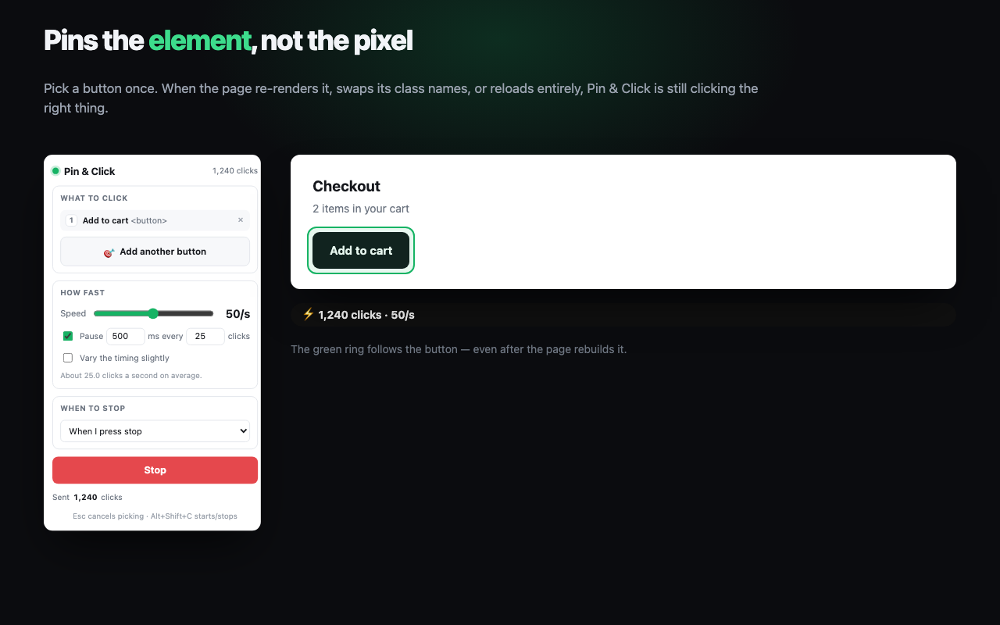
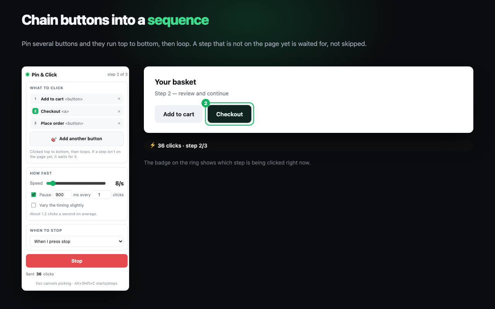
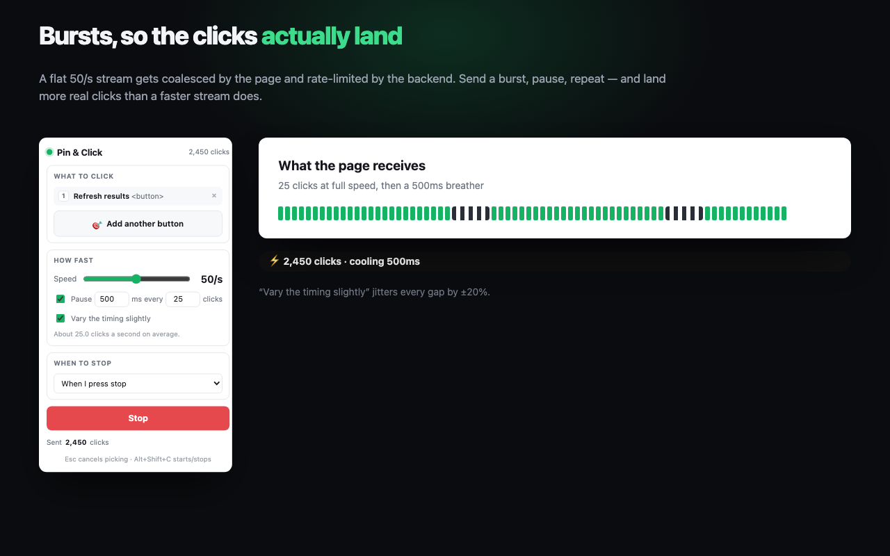
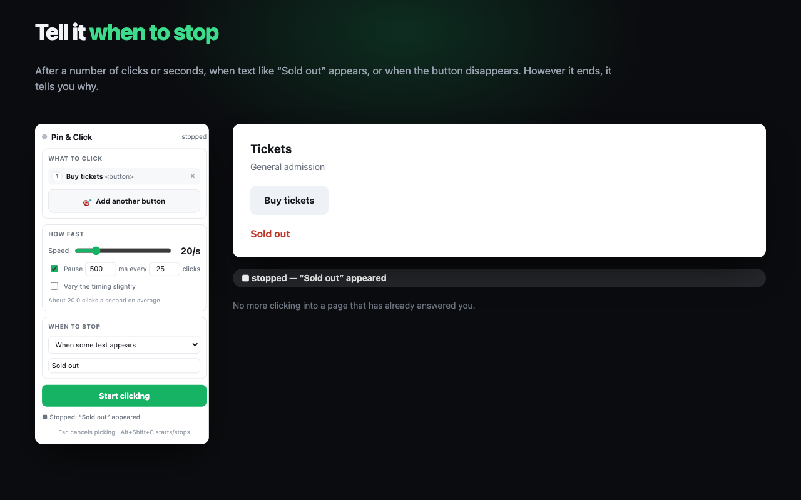
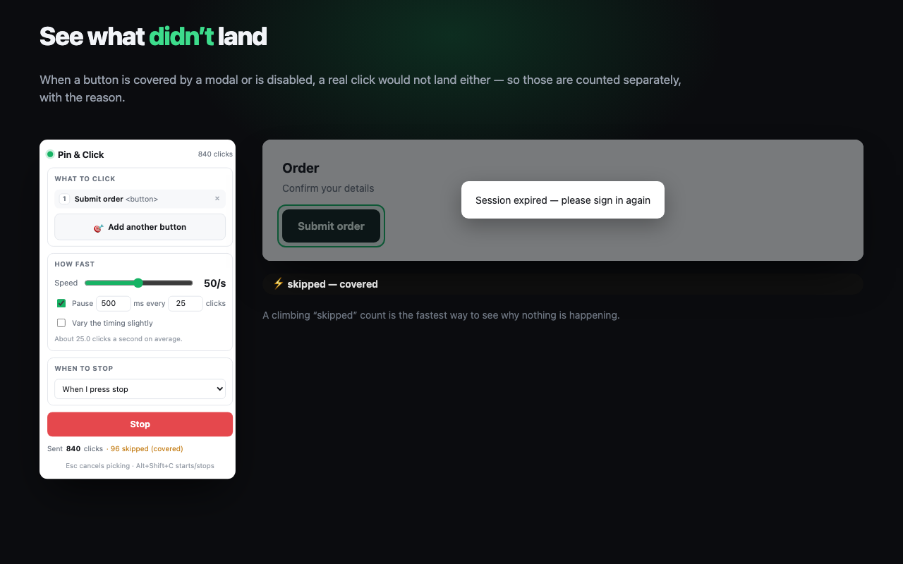

# Chrome Web Store listing — Pin & Click

Everything below is ready to paste into the Developer Dashboard, field by field.
Assets are in `store/shots/` and `icons/`.

---

## Store listing tab

**Item name** (max 75)
```
Pin & Click — Fast Auto Clicker
```

**Short description / summary** (max 132 — this is also the manifest `description`)
```
Pin a button once, then auto-click it up to 100x/sec. Chain buttons into a sequence and set when it should stop.
```

**Category:** Developer Tools
**Language:** English (United Kingdom) or English (United States)

**Detailed description** (paste as-is)
```
Pin & Click pins the ELEMENT you picked, not a pixel on the screen.

Every other auto clicker hammers a coordinate, so the moment the page re-renders the
button, moves it, or reloads, it's clicking empty space. Pin & Click re-finds your button
before every single click — so it keeps working through re-renders, class-name changes,
and full page reloads.

WHAT IT DOES

• Pick a button once, then click it from 1 to 100 times a second.
• Chain several buttons into a sequence — they run top to bottom, then loop. Enough to
  drive a real flow like add-to-cart, checkout, confirm.
• If the next button isn't on the page yet, it waits for it instead of skipping ahead —
  because that button usually only appears BECAUSE the previous one was clicked.
• Burst mode: send a batch of clicks, then pause. A flat 50/s stream gets coalesced by the
  page and rate-limited by the server, so bursts land more real clicks than a faster
  stream does. Optional jitter varies each gap by ±20%.
• Stop conditions: after a number of clicks, after a number of seconds, when text like
  "Sold out" appears, or when the button disappears. However it ends, it tells you why.
• A running tally of clicks sent, and clicks skipped — with the reason, so you can see
  when a button is covered by a modal or disabled and nothing would have landed anyway.
• Remembers your target and settings per page, and picks up again after a reload.
• Works inside iframes.
• Alt+Shift+C starts and stops. Esc cancels picking.

HOW TO USE IT

1. Open the popup and click "Pick a button on the page" — the cursor becomes a crosshair.
2. Click the button you want. Add more buttons to build a sequence.
3. Choose a speed and, if you want, a stop condition.
4. Press Start. A pill in the corner shows the live count, and a green ring marks whatever
   is being clicked right now.

HONEST LIMITS

• Clicks are browser events (isTrusted: false). Normal web pages, including React and Vue
  apps, accept them. Things that require real operating-system input do not: file pickers,
  Chrome's own permission prompts, and some game canvases with anti-cheat. No extension can
  do that — the repo includes a separate native command-line clicker for those cases.
• "Skipped" tells you a click could not have landed (the button was covered or disabled).
  Whether the page's own code actually acted on a click is not observable from outside the
  page, so nothing here pretends to measure it.

PRIVACY

No accounts, no analytics, no servers, no network requests at all. The button you picked
and your settings are saved in your browser's local extension storage and never leave your
device. The full source is public: https://github.com/shubambhasin/pin-and-click

Use it on things you are allowed to click.
```

**Homepage URL:** `https://pin-and-click.vercel.app`
**Support URL:** `https://github.com/shubambhasin/pin-and-click/issues`

### Graphic assets

| Asset | Requirement | File | Preview |
| --- | --- | --- | --- |
| Store icon | 128x128 PNG | `icons/icon128.png` |  |
| Screenshot 1 | 1280x800 PNG | `store/shots/1-pins-the-element.png` |  |
| Screenshot 2 | 1280x800 PNG | `store/shots/2-sequences.png` |  |
| Screenshot 3 | 1280x800 PNG | `store/shots/3-burst-mode.png` |  |
| Screenshot 4 | 1280x800 PNG | `store/shots/4-stop-conditions.png` |  |
| Screenshot 5 | 1280x800 PNG | `store/shots/5-sent-vs-skipped.png` |  |

Upload them to the dashboard in this order — screenshot 1 is the one users see first.

Small promo tile (440x280) is optional and only needed to be featured — skipped.

---

## Privacy tab

**Single purpose description**
```
Pin & Click automates clicking on a web element the user has explicitly selected. Its
single purpose is to repeatedly dispatch click events to one or more user-picked elements
on the current page, at a user-chosen rate, until a user-chosen stop condition is met.
```

**Permission justifications**

`storage`
```
Stores the user's chosen target (a CSS selector, tag name, visible text and last known
position of each picked element) and their speed and stop-condition settings, so the
extension can re-find the element after the page re-renders and can resume after a reload.
All of it stays in local extension storage; nothing is transmitted.
```

Host permission — broad site access (`<all_urls>`)
```
The user can pin a button on any website, so the extension must be able to run its content
script on whichever page the user is on. The content script only reads the page to locate
the element the user picked and to dispatch clicks to it. It is idle on every page where
the user has not picked a target, and it never sends page data anywhere.
```

**Remote code:** No, I am not using remote code. (Everything is bundled; there are no
external scripts, no eval of fetched code.)

**Data usage — check nothing.** Then tick all three certifications:
- I do not sell or transfer user data to third parties, outside of approved use cases
- I do not use or transfer user data for purposes unrelated to my item's single purpose
- I do not use or transfer user data to determine creditworthiness or for lending purposes

**Privacy policy URL:** `https://pin-and-click.vercel.app/privacy.html`

---

## Distribution tab

- **Visibility:** Public (or Unlisted, if you want the link-only version first)
- **Distribution:** All regions
- **Pricing:** Free

---

## What to upload

Build the package first — the zip must contain `icons/`, or it won't load:

```sh
./scripts/build-zip.sh          # writes site/pin-and-click.zip
```

Upload `site/pin-and-click.zip`. It contains `manifest.json`, the four scripts, two
stylesheets, `popup.html`, `README.md` and `icons/` — no source maps, no build junk.

---

## Steps only you can do

These need your Google account and your money, so they're yours:

1. **Register as a developer** at https://chrome.google.com/webstore/devconsole — a
   **one-time US$5 fee**, paid with your own card.
2. **Accept the developer agreement.**
3. Create a new item, upload the zip, paste the fields above, upload the five screenshots.
4. **Submit for review.** First reviews typically take a few days; broad host permissions
   can push that longer.

## Two things that may come back from review

1. **Broad site access gets extra scrutiny.** The justification above is the honest one —
   the feature genuinely requires running on whatever page you're on. If a reviewer pushes
   back, the fallback is `activeTab` + a click-to-inject flow, which costs the auto-resume
   after reload.
2. **Automation policy.** Auto-clickers are allowed, but anything framed as defeating a
   site's protections, gaming a game, or generating fake engagement is not. The listing
   above deliberately frames it as a user-driven automation utility and ends with "use it
   on things you are allowed to click" — keep that framing.
